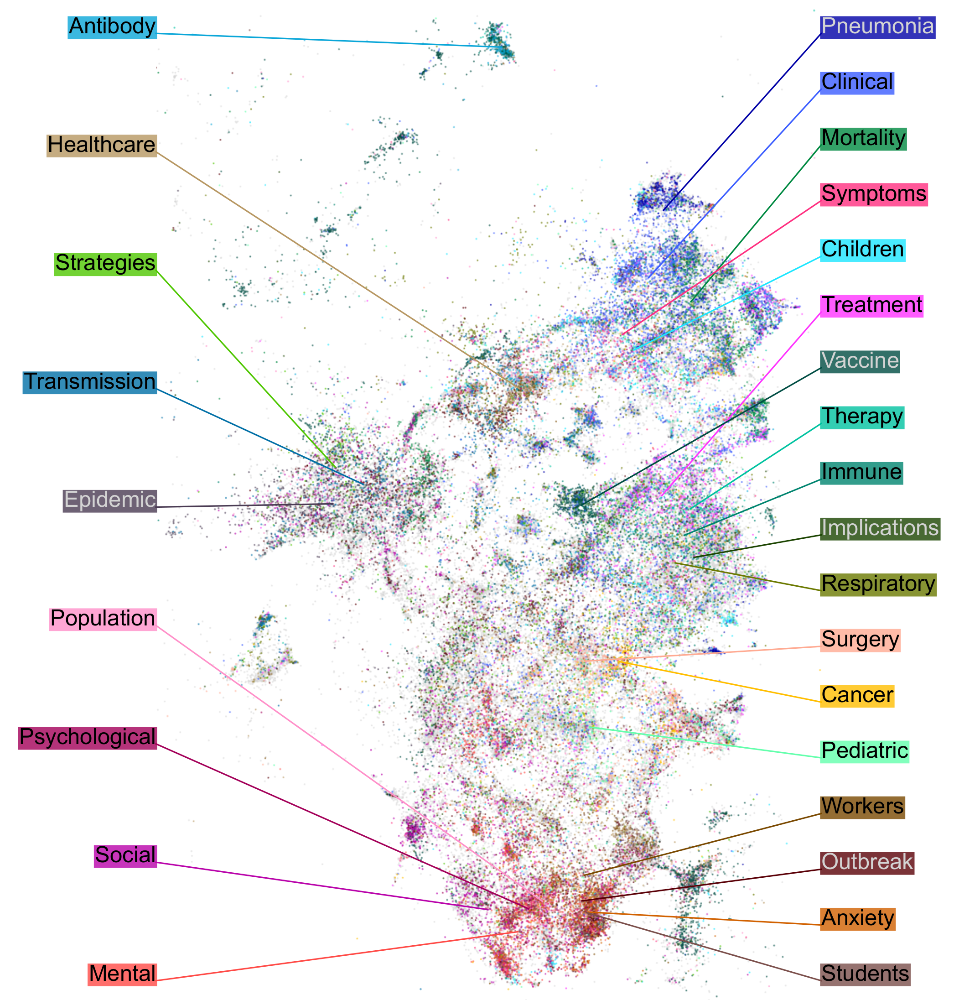
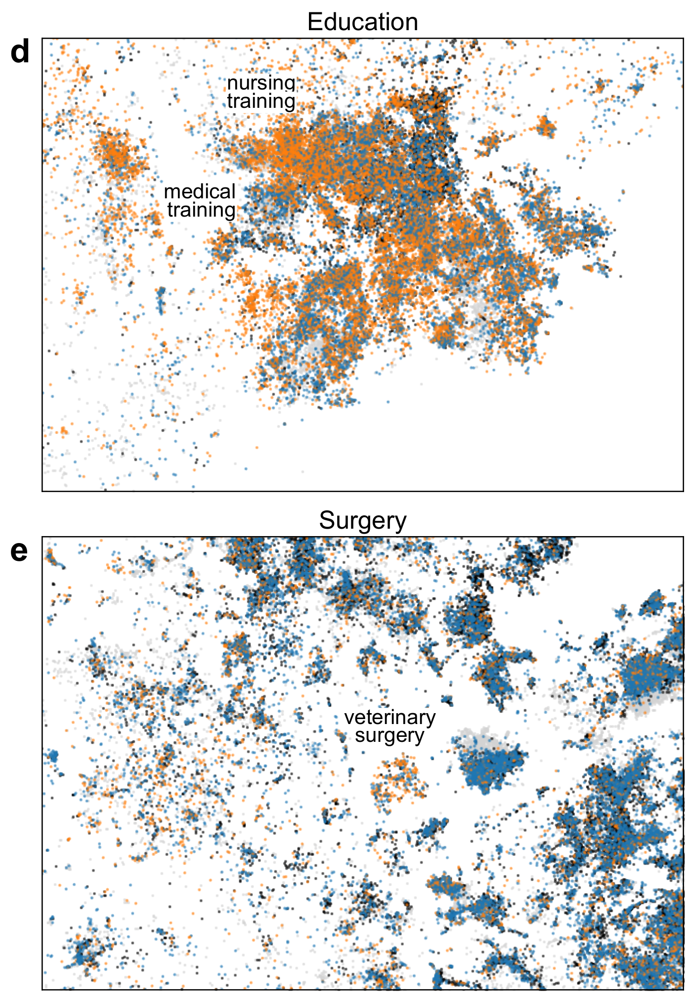
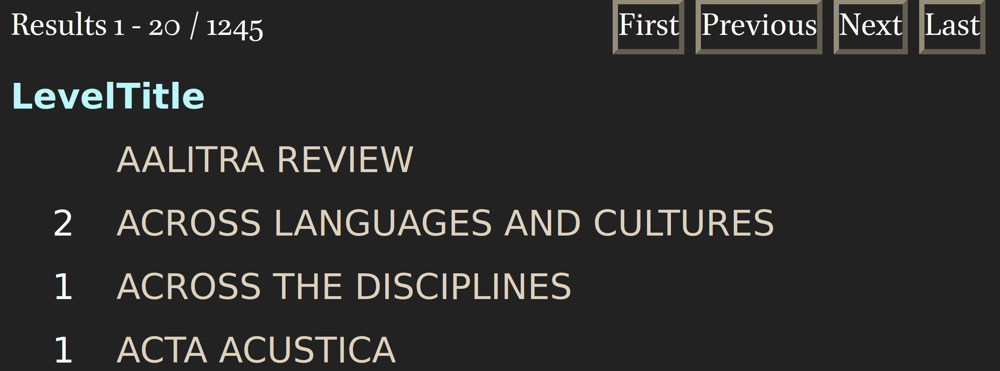

```{r, include=FALSE}
knitr::opts_chunk$set(echo = FALSE, warning = FALSE, message = FALSE, dev='cairo_pdf', fig.align='center', fig.show='hold')
# setwd("/home/agricolamz/work/materials/2023.06.16_HSE_linguistic_bibliometrics")
library(tidyverse)
library(tidytext)
library(stopwords)
library(kableExtra)
theme_set(theme_minimal()+theme(text = element_text(size = 16), legend.position = "bottom"))
```

#  Введение

##  [@gonzalez23] ландшафт биомедицинских исследований

> The number of publications in biomedicine and life sciences has rapidly grown over the last decades, with over 1.5 million papers now published every year. This makes it difficult to keep track of new scientific works and to have an overview of the evolution of the field as a whole. Here we present a 2D atlas of the entire corpus of biomedical literature, and argue that it provides a unique and useful overview of the life sciences research. <...>

<https://static.nomic.ai/pubmed.html> (интерактивная версия)

**Это препринт!**

##  [@gonzalez23]

```{r, out.width='65%'}
knitr::include_graphics("images/01_landscape.png")
```

2D эмбеддинги на основе 21 миллиона аннотаций, которые были траснформированы в 768-мерное векторное пространство при помощи PubMedBERT [@gu21], а дальше сплюснутая в 2D при помощи t-SNE [@maaten08]. Цвета основаны на названиях журналов.

##  [@gonzalez23]

```{r, out.width='49%'}
knitr::include_graphics("images/02_landscape_by_year.png")

```

Регион карты, посвященный Covid-19. Цвета приписаны на основе названий работ. Кроме того здесь есть около 15% работ не посвященных короновирусу.

##  [@gonzalez23]

```{r, out.width='43%'}
knitr::include_graphics("images/04_landscape_by_gender.png")

```

Статьи раскрашены по полу первого автора.

# Наш проект

##  План

- выбрать список журналов для анализа
- извлечь аннотации для всех работ из выбранных журналов
- использовать векторизатор и метод уменьшения размерностей для преобразования пространства аннотаций в 2D
- исследовать насколько релевантно для лингвистики получившееся пространство 

# Сбор данных

## Списки журналов

Мы использовали несколько источников журналов

- Тэг `филология, лингвистика, медиакоммуникации` в вышкинском списке журналов

```{r, out.width='70%'}
knitr::include_graphics("images/07_hse_journal_list.png")
```

- Тэг `6162 Languages` в списке журналов из ресурса [Finish Publication Forum](https://www.tsv.fi/julkaisufoorumi/haku.php)

```{r, out.width='45%'}

```

## Списки журналов

После соединения списков журналов мы по своему усмотрению разметили их по некоторым категориям (теги: `linguistics` (418), `interdisciplinary` (414), `language_learning` (43) и другие).

Отдельный подпроект: литературоведение (тэги: `literary_studies` (432), `interdisciplinary` (503), `philology` (12) и другие).

```{r}
journals <- read_csv("/home/agricolamz/work/bureaucracy/linguistic_convergency/journals/repo/abcd_list_annotated.csv")

linguistics <- journals |> filter(linguistics == "linguistics") |> nrow()
annotated_journals <- journals |> filter(!is.na(linguistics)) |> nrow()
not_annotated_journals <- journals |> filter(is.na(linguistics)) |> nrow()
```

После разметки `r linguistics` (`r round(linguistics/annotated_journals*100)`%) журналов из `r annotated_journals` получили тэг `linguistics`.

```{r}
journals |> 
  filter(linguistics == "linguistics") |>
  count(hse_level, helsenki_level)  |> 
  pivot_wider(names_from = helsenki_level, values_from = n, values_fill = 0)  |> 
  rename(`HSE level` = hse_level) |> 
  kable() |> 
  add_header_above(c(" " = 1, "Helsenki level" = 5)) |> 
  kable_styling(position = "center")
```

## Сбор аннотаций лингвистических исследований

>- Мы планировали написать краулер, который бы собирал статьи из желаемых журналов...
>- но мы обнаружили базу данных `Crossref` и соответствующий пакет для R `rcrossref` [@chamberlain22]...
>- а потом мы обнаружили базу данных `OpenAlex` и соответствующий пакет для R `openalexR` [@aria23]

# Описательная статистика

```{r}
path <- "/home/agricolamz/work/bureaucracy/linguistic_convergency/journals/repo/openalex"
files <- str_c(list.files(path, full.names = TRUE), "/", list.files(path), ".csv")
map(files, function(x){
  read_csv(x, col_types = list(publication_year = "c", 
                               first_page = "c", 
                               last_page = "c", 
                               volume = "c", 
                               issue = "c", 
                               is_retracted = "c", 
                               cited_by_count = "c"), 
           show_col_types = FALSE)
}) |> 
  list_rbind() ->
  database

rm(path, files)

non_cleaned_database_rows <- nrow(database)
non_cleaned_database_cols <- ncol(database)
```

## Структура данных: `r non_cleaned_database_rows` строчек, `r non_cleaned_database_cols` колонок

- `id`: https://openalex.org/W3040611730
- `doi`: https://doi.org/10.1075/fol.18056.dob
- `author`: Nina Dobrushina 
- `title`: Negation in complement clauses of fear-verbs 
- `publication_year`: 2021
- `journal`: Functions of Language
- `issn_l`: 0929-998X
- `first_page`: 121
- `last_page`: 152 
- `volume`: 28 
- `issue`: 2
- `is_retracted`: FALSE
- `cited_by_count`: 1
- `abstract`: \tiny Complement clauses of verbs of fear often contain expletive negation, which is negative marking without negative meaning. <...> \normalsize
- `concepts`: \tiny Negation; Complement (music); Linguistics; Verb; Meaning (existential); Psychology; Mathematics; Computer science; Philosophy; Biochemistry; Chemistry; Complementation; Psychotherapist; Gene; Phenotype \normalsize
- `tags_level`: 2; 5; 1; 2; 2; 0; 0; 0; 0; 1; 0; 4; 1; 2; 3
- `tags_score`: 0.90950537; 0.85906583; 0.7152109; 0.6710381; 0.53753835; 0.37817067; 0.36315864; 0.33024567; 0.17123953; 0; 0; 0; 0; 0; 0
- `retrieved`: 30-04-2023
- `source`: openalex 

```{r}
doi_to_remove <- read_csv("/home/agricolamz/work/bureaucracy/linguistic_convergency/journals/repo/scripts/doi_to_remove.csv")

database |> 
  anti_join(doi_to_remove) |> 
  mutate(publication_year = as.double(publication_year),
         cited_by_count = as.double(cited_by_count)) |> 
  filter(!duplicated(tolower(abstract))) ->
  database

cleaned_database_rows <- nrow(database)
rm(database, doi_to_remove)
```

## Чистка данных

Нам пришлось достаточно существенно почистить данные:

- аннотации не на английском языке
- аннотации, отмененных (retracted) статей 
- размеченные как аннотации информационные сообщения журналов
- мусор, который отмечен как аннотация

... так что осталось `r cleaned_database_rows` строк.

# Ландшафт лингвистических исследований

## Векторное представление слов

- мы использовали векторизатор `doc2vec` [@le14; @wijffels21] (смотрели GloVe [@pennington14], думаем в сторону BERT [@devlin18] и RoBERTa [@liu19])
- полученное 50-мерное пространство мы схлопывали при помощи t-SNE  [@maaten08]

## Ландшафт лингвистических исследований

```{r, out.width='100%'}
embedings <- read_csv("/home/agricolamz/work/bureaucracy/linguistic_convergency/journals/repo/tsne/2023-06-13.csv")

embedings |> 
  ggplot(aes(V1, V2))+
  geom_point(size = 0.1, alpha = 0.2)+
  theme_void()
```

## Фонетика и фонология

```{r, out.width='100%'}
pattern_for_search <- "PHON"

embedings |> 
  distinct(journal_issn) |> 
  filter(str_detect(journal_issn, pattern_for_search)) |> 
  pull(journal_issn) |> 
  str_c(collapse = "; ") ->
  journals

embedings |> 
  mutate(target = str_detect(journal_issn, pattern_for_search),
         target_alpha = ifelse(target, 1, 0.2),
         target = ifelse(target, "phonetics", "other"),
         target = factor(target, levels = c("phonetics", "other"))) |> 
  ggplot(aes(V1, V2, color = target, alpha = target_alpha))+
  geom_point(size = 0.1)+
  theme_void()+
  theme(legend.position = "none")
```

\tiny
`r journals`

## Психолингвистика

```{r, out.width='100%'}
pattern_for_search <- "PSYCH"
embedings |> 
  distinct(journal_issn) |> 
  filter(str_detect(journal_issn, pattern_for_search)) |> 
  pull(journal_issn) |> 
  str_c(collapse = "; ") ->
  journals

embedings |> 
  mutate(target = str_detect(journal_issn, pattern_for_search),
         target_alpha = ifelse(target, 1, 0.2),
         target = ifelse(target, "psycholinguistics", "other"),
         target = factor(target, levels = c("psycholinguistics", "other"))) |> 
  ggplot(aes(V1, V2, color = target, alpha = target_alpha))+
  geom_point(size = 0.1)+
  theme_void()+
  theme(legend.position = "none")
```

\tiny
`r journals`

## Corpus/comput/quant

```{r, out.width='100%'}
pattern_for_search <- "(CORP)|(COMPU)|(MACHINE)|(QUANTITATIVE)"

embedings |> 
  distinct(journal_issn) |> 
  filter(str_detect(journal_issn, pattern_for_search)) |> 
  pull(journal_issn) |> 
  str_c(collapse = "; ") ->
  journals

embedings |> 
  mutate(target = str_detect(journal_issn, pattern_for_search),
         target_alpha = ifelse(target, 1, 0.2),
         target = ifelse(target, "cognitive", "other"),
         target = factor(target, levels = c("cognitive", "other"))) |> 
  ggplot(aes(V1, V2, color = target, alpha = target_alpha))+
  geom_point(size = 0.1)+
  theme_void()+
  theme(legend.position = "none")
```

\tiny
`r journals`

## Ономастика

```{r, out.width='100%'}
pattern_for_search <- "ONOMA"

embedings |> 
  distinct(journal_issn) |> 
  filter(str_detect(journal_issn, pattern_for_search)) |> 
  pull(journal_issn) |> 
  str_c(collapse = "; ") ->
  journals

embedings |> 
  mutate(target = str_detect(journal_issn, pattern_for_search),
         target_alpha = ifelse(target, 1, 0.2),
         target = ifelse(target, "onomastics", "other"),
         target = factor(target, levels = c("onomastics", "other"))) |> 
  ggplot(aes(V1, V2, color = target, alpha = target_alpha))+
  geom_point(size = 0.1)+
  theme_void()+
  theme(legend.position = "none")
```

\tiny
`r journals`

## William Labov

```{r, out.width='100%'}
embedings |> 
  filter(!str_detect(author, "William Labov")) |> 
  ggplot(aes(V1, V2))+
  geom_point(alpha = 0.1, size = 0.1)+
  geom_point(color = "tomato", size = 2, data = embedings |> filter(str_detect(author, "William Labov")))+
  theme_void()+
  theme(legend.position = "none")
```


## Michael Halliday

```{r, out.width='100%'}
embedings |> 
  filter(!str_detect(author, "Michael Halliday")) |> 
  ggplot(aes(V1, V2))+
  geom_point(alpha = 0.1, size = 0.1)+
  geom_point(color = "tomato", size = 2, data = embedings |> filter(str_detect(author, "Michael Halliday")))+
  theme_void()+
  theme(legend.position = "none")
```

## Johanna Nichols

```{r, out.width='100%'}
embedings |> 
  filter(!str_detect(author, "Johanna Nichols")) |> 
  ggplot(aes(V1, V2))+
  geom_point(alpha = 0.1, size = 0.1)+
  geom_point(color = "tomato", size = 2, data = embedings |> filter(str_detect(author, "Johanna Nichols")))+
  theme_void()+
  theme(legend.position = "none")
```

# Заключение

## Заключение

>- Нужно исследовать полученное пространство
>- Нужно разметить аннотации, а не идти от журналов
>- Разметка журналов нуждается в дополнительной проверке
>- Интересно посмотреть другие векторизаторы (BERT, RoBERTa)
>- Интересно сравнить разные методы уменьшения размерности (t-SNE vs UMAP)
>- Не стоит обобщать знания, полученные на основе журналов на всю лингвистику: еще бывают книги, главы в сборниках и т. п.

## {}

\LARGE Спасибо за внимание!

# Литература {.allowframebreaks}